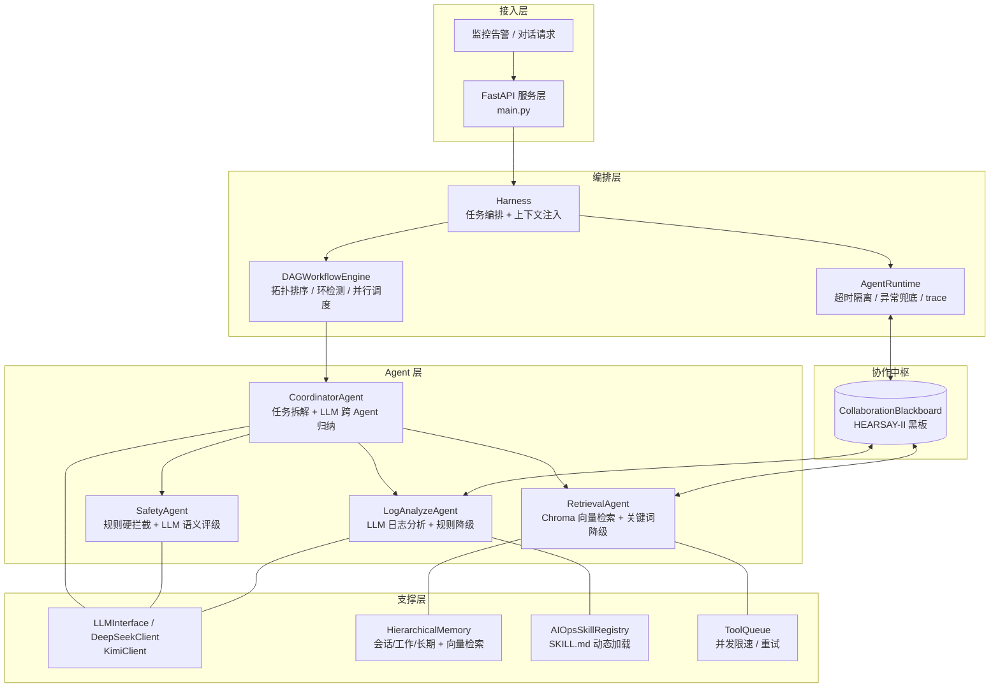

# MindBridge-AIOps

> 基于 **黑板模式（HEARSAY-II）多智能体协作** 的 AIOps 智能运维告警处置系统。
> 接收监控告警 → 多 Agent 并行分析（日志 / 知识检索）→ Coordinator 跨 Agent 归纳 → Safety 安全护栏拦截 → 输出处置报告与工作交接摘要。

---

## 为什么值得一看

- **真正的多 Agent 协作**：以 `CollaborationBlackboard` 为中枢，Coordinator 拆解任务、Specialist Agent 认领执行、结果回写黑板，遵循成熟的 HEARSAY-II 黑板架构，而非单 Agent 调用 LLM 的简易封装。
- **LLM 推理链路完整**：`DeepSeekClient`（OpenAI 兼容、`httpx` 流式/非流式）贯穿 LogAnalyzeAgent、RetrievalAgent、Coordinator 归纳、Safety 语义评级，并统一抽象为 `LLMInterface`。
- **安全护栏（Guardrails）**：Safety Agent 双层防护 —— 正则规则**硬拦截**显式高危命令 + LLM **语义级风险评级**捕获隐式高危意图，高危操作强制人工复核。
- **工程化交付**：FastAPI 服务层、全程 `asyncio` 异步、`AgentRuntime` 超时隔离与异常兜底、分层记忆（会话/工作/长期 + Chroma 向量检索）、pytest 覆盖核心链路。

---

## 架构图



---

## 数据流（一次告警处置）

1. **接入**：告警经 `main.py` 进入，Harness 构建 `ExecutionContext`（含 `trace_id`）。
2. **拆解**：Coordinator 在黑板上发布 `log_analysis` / `knowledge_retrieval` 子任务。
3. **并行分析**：
   - `LogAnalyzeAgent` 调用 DeepSeek 解析日志，输出根因 / error_type / suggested_actions（无 key 时降级规则）。
   - `RetrievalAgent` 对 Chroma 向量库检索历史案例，无结果时降级中文 2-gram 关键词匹配。
4. **归纳**：Coordinator 收集黑板产物，调用 LLM 做跨 Agent 根因关联与处置优先级排序（`_synthesize`，LLM 失败则规则降级）。
5. **安全护栏**：Safety Agent 先做正则硬拦截；未命中时由 LLM 做语义级风险评级，高危一律 `intercepted=True` 强制人工复核。
6. **输出**：最终报告（摘要 / 处置计划 / 相关案例 / 交接摘要）经 API 返回前端。

---

## 模块贡献度（用于面试陈述）

| 模块 | 实现深度 | 说明 |
|------|---------|------|
| `LogAnalyzeAgent` | ★★★★★ | LLM 优先 + 规则降级，含 prompt 工程与 JSON 解析 |
| `RetrievalAgent` | ★★★★★ | Chroma 向量检索 + 中文分词关键词降级 |
| `DeepSeekClient` | ★★★★★ | 真实 API 调用、流式/非流式、OpenAI 兼容 |
| `CoordinatorAgent._synthesize` | ★★★★☆ | 新增 LLM 跨 Agent 结构化归纳（规则降级兜底） |
| `SafetyAgent` | ★★★★☆ | 规则硬拦截 + 新增 LLM 语义风险评级分支 |
| `CollaborationBlackboard` | ★★★★☆ | HEARSAY-II 黑板，事件订阅/认领机制 |
| `AgentRuntime` / `DAGWorkflowEngine` | ★★★★☆ | 超时隔离、异常兜底、DAG 并行调度 |
| `HierarchicalMemory` | ★★★☆☆ | 三级记忆 + 向量检索 |
| `AIOpsSkillRegistry` | ★★★☆☆ | 从 `SKILL.md` 动态加载技能 |

---

## 快速开始

```bash
pip install -r requirements.txt

# 配置 LLM（不配置则走规则降级路径，系统仍可运行）
export DEEPSEEK_API_KEY="your-key"

# 启动 API 服务
python -m app.main

# 运行测试
pytest -q
```

## 测试

```bash
pytest tests/            # harness / rag / skill_mcp / factory 等
pytest tests/test_harness.py -v
```

---

## 目录结构

```
app/
├── main.py                # FastAPI 服务层
├── agents/                # Coordinator / LogAnalyzer / Retrieval / Safety / 基类
├── blackboard/            # HEARSAY-II 协作黑板
├── runtime/               # AgentRuntime / DAGWorkflowEngine / Context / Trace
├── llm/                   # LLMInterface / DeepSeekClient / KimiClient
├── memory/                # 分层记忆 + 向量检索
├── skills/                # 技能注册与动态加载
├── mcp/                   # ToolQueue 并发治理
└── models/                # 领域模型
tests/                     # pytest 单测
```
